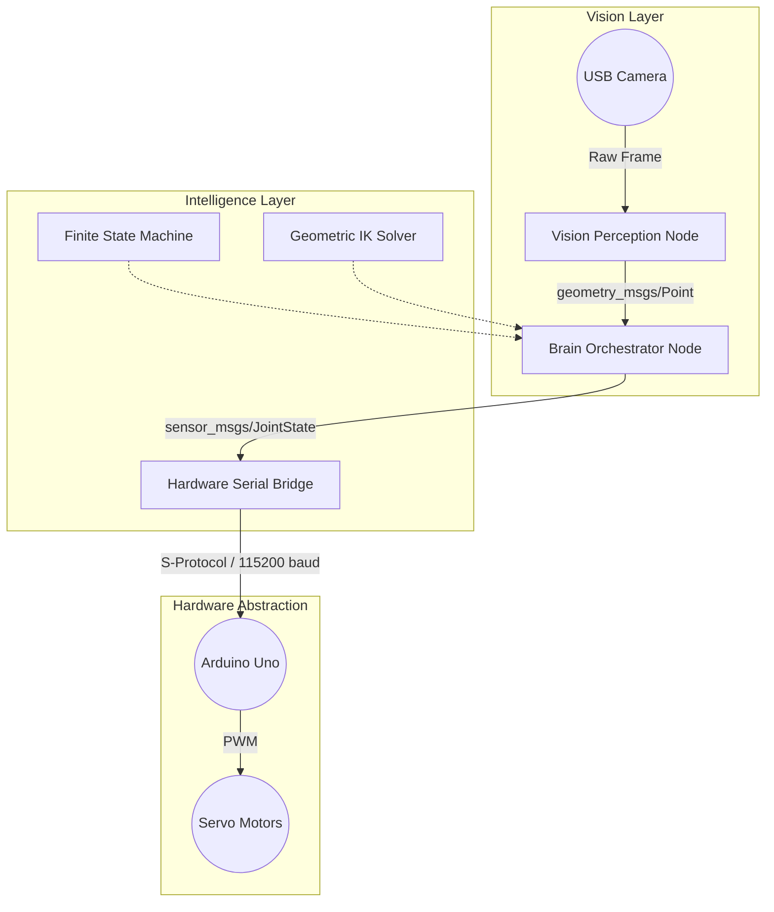

# ARIS: Autonomous Robotic Intelligence System

[](https://docs.ros.org/en/jazzy/)
[](https://www.python.org/)
[](https://ubuntu.com/)
[](./LICENSE)

ARIS is a full-stack, autonomous 5-DOF robotic manipulator control system built entirely on **ROS 2**. Designed for high-performance pick-and-place operations, it bypasses the need for external cloud AI or depth sensors. Instead, it relies on a highly optimized, local vision pipeline and a custom-built Geometric Inverse Kinematics (IK) solver to execute real-time closed-loop manipulation.

---

## 🏗️ System Architecture

The project is structured into three highly decoupled ROS 2 nodes, ensuring zero blocking calls and maintaining a strict 20Hz control loop.



### 1. Vision Perception (`robotic_arm_vision`)
A real-time OpenCV-based tracker. It utilizes a **Perspective Projection Model** to map 2D pixel coordinates (from a standard, forward-facing RGB camera) into a precise 3D spatial coordinate on the workspace plane, completely eliminating the need for expensive RGB-D sensors.

### 2. Task Orchestrator & IK (`robotic_arm_brain`)
The core intelligence layer. It hosts the master **Finite State Machine (FSM)** (`SCANNING`, `APPROACHING`, `GRASPING`, `DELIVERING`). 
* **Engineering Decision:** Standard MoveIt 2 IK service calls were replaced with a **Custom Geometric IK Solver**. This architectural shift reduced trajectory calculation latency from ~200ms to <5ms, allowing for seamless, fluid motion tracking.

### 3. Hardware Bridge (`robotic_arm_hardware`)
A lightweight, fault-tolerant serial bridge connecting the ROS 2 network to the low-level Arduino controller via the custom **S-Protocol**.

---

## ⚙️ The S-Protocol Definition

To ensure maximum throughput over serial, joint states are packaged into a condensed, human-readable string formatted as follows:

```text
S:<Waist>,<Shoulder>,<Elbow>,<Roll>,<Pitch>,<Grip>\n
```
* **Baud Rate:** 115,200
* **Update Frequency:** ~20Hz
* **Payload Size:** < 30 bytes per frame

---

## 🚀 Quick Start & Installation

This project is built and tested natively on **Ubuntu 24.04** with **ROS 2 Jazzy**.

### 1. Workspace Initialization
```bash
git clone https://github.com/AhmedAI-dev/roboticarmproject.git
cd roboticarmproject/ros2_workspace
```

### 2. Dependency Resolution
For a comprehensive, manual installation of all required dependencies (including venv setup), please refer to the strictly maintained **[SYSTEM_SETUP.md](./SYSTEM_SETUP.md)**.
```bash
source /opt/ros/jazzy/setup.bash
rosdep install --from-paths src --ignore-src -r -y
```

### 3. Build & Source
```bash
colcon build --symlink-install
source install/setup.bash
```

### 4. Firmware Upload
Flash the provided `arduino_firmware/robotic_arm_firmware/robotic_arm_firmware.ino` to your Arduino board prior to launching the hardware bridge.

---

## 🎮 Execution Modes

Ensure the workspace is sourced before execution:
```bash
source install/setup.bash
```

| Mode | Command | Description |
|---|---|---|
| **Autonomous AI** | `ros2 launch robotic_arm_bringup ai_full_system.launch.py` | Launches the complete closed-loop vision and manipulation pipeline. |
| **Manual Teleop** | `ros2 launch robotic_arm_bringup manual_control.launch.py` | Bypasses the AI layer; allows direct joint control via RViz2 sliders. |
| **Simulation** | `ros2 launch robotic_arm_bringup display.launch.py` | RViz2 visualization only (No hardware required). |

---

## 📂 Repository Structure

```text
roboticarmproject/
├── arduino_firmware/                # Arduino Servo Controller Logic
├── standalone_gui/                  # Direct Python-to-Serial testing tool
├── Media/                           # Demonstration videos
│   └── hardware_design/             # Physical 3D CAD files (.STEP)
├── SYSTEM_SETUP.md                  # Comprehensive dependency guide
└── ros2_workspace/                  # ROS 2 Core
    └── src/
        ├── robotic_arm_brain        # IK & State Machine
        ├── robotic_arm_vision       # Coordinate Projection
        ├── robotic_arm_hardware     # S-Protocol Bridge
        ├── robotic_arm_description  # URDF & Meshes
        ├── robotic_arm_bringup      # Launch Orchestration
        ├── robotic_arm_teleop       # GUI Sliders
        ├── robotic_arm_moveit_config# MoveIt 2 definitions
        └── robotic_arm_visualization# RViz Configs
```

---

## ⚖️ License
Distributed under the Apache License 2.0. See `LICENSE` for more information.
